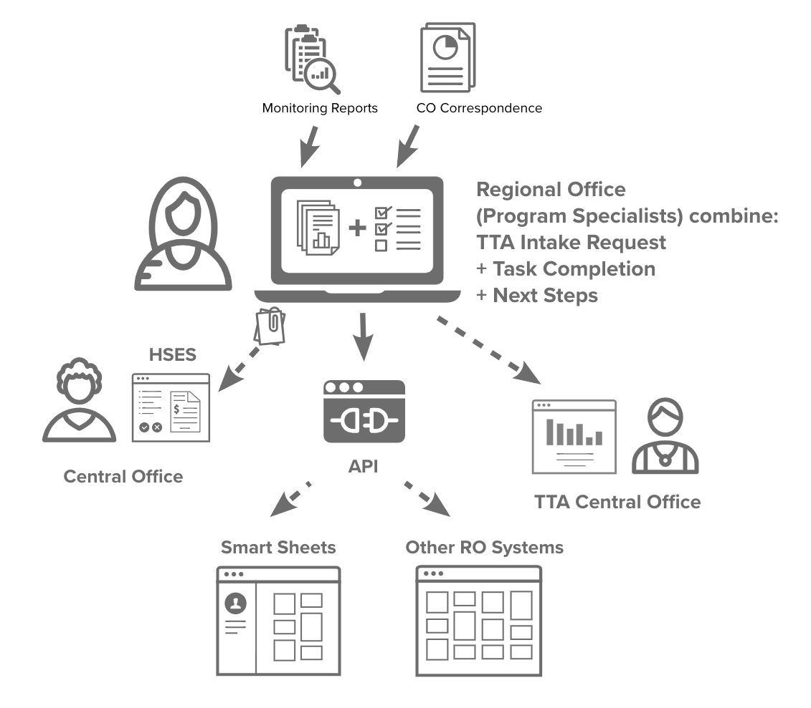

## 1.0 Background and Purpose

### 1.1	Background

Local Head Start programs prepare America’s most vulnerable young children, ages birth to 5, to succeed in school and in life. About 1,600 agencies across the country receive grant funding and oversight from the [Office of Head Start (OHS)](https://eclkc.ohs.acf.hhs.gov/about-us/article/about-office-head-start) to operate local Head Start programs, which enroll about 1 million children each year. OHS ensures that grantees meet [federal standards](https://eclkc.ohs.acf.hhs.gov/policy/45-cfr-chap-xiii) for operating safe and effective programs. 

Head Start was launched as a federal pilot program in 1965 and has a powerful track record of innovation [and effectiveness](https://eclkc.ohs.acf.hhs.gov/story) in early childhood education. More than 37 million Americans have attended Head Start programs. 

Head Start programs deliver comprehensive services to children and families in core areas of early learning, health, and family well-being. Most programs operate in centers, though services can also be offered in family child care homes, an individual family's home, or locally designed options, such as inside a homeless shelter.

To help grantees deliver high-quality services, OHS is legislatively mandated and funded to provide a training and technical assistance (TTA) system. TTA activities are planned and delivered at the national, regional and grantee levels; each level has a distinct function designed to complement the others. For a detailed explanation of how the TTA system operates, see [this page.](https://www.acf.hhs.gov/ohs/assistance) 

Examples of TTA include, but are not limited to, the following: 

* Individual TTA: In-person or virtual meetings where a single grantee and TTA provider address a specific issue, such as helping a staff person set up a coaching program to support teachers and improve the quality of instruction. The TTA objective could be completed in a single session or extend over several engagements. 

* Group TTA: In-person, virtual sessions or a combination where several grantees address a common issue, such as serving the needs of families affected by opioid misuse. 

### 1.2	Problems OHS is looking to address 

As noted above, TTA activities are planned and delivered at the federal, regional and local grantee levels. However, while there is multiple points of data capture, there is no centralized data system for TTA leaders in Central Office and 12 Regions, their contractors, or grantees to share information about myriad TTA needs, activities or outcomes. Various streams of TTA data are: 

1. housed in a comprehensive Central Office system that was not designed for TTA task management; 
2. housed in a limited legacy system that won’t meet federal IT standards; 
3. held in stand-alone systems managed by regional contractors; and 
4. held in non-standardized documents held by individuals at various levels of the system. 

These information silos make it difficult for OHS TTA leaders to:

* ensure that TTA is data-driven, responsive to grantee needs and effective; and
* provide real-time oversight and quality assurance of the 12 regional TTA  contracts and 4 national TTA cooperative agreements.

#### 1.2.1 Narrative and Anecdotal Information 

Regional TTA contractors must complete TTA Activity Reports, which contain abundant narrative data. Text-heavy narrative data can be helpful but it is hard to compare or track over time. People may also overlook the value of narrative data or choose other sources, such as anecdotal information, because trying to decipher a lot of text is overwhelming and frustrating. 

#### 1.2.2 Disconnected Systems

TTA requests, reports and other data are housed in disparate systems that often weren’t built for managing comprehensive TTA tasks. Some are OHS-controlled, others are independent. Extracting and comparing data across these systems is difficult and time-consuming. There is a lack of consistency in solutions and systems at all levels (Central Office, Regional Offices, TTA contractors, states, and grantees).  

#### 1.2.3 Data Access

Different systems require different credentials and have restricted access for different users, which don’t always reflect user needs. Existing data can be difficult to access. 

#### 1.2.4 Data Inconsistency

Across TTA Activity Reports, email TTA summaries and official correspondence, people may use inconsistent terms to describe issues they are working on. Different TTA contracts may also adapt federal forms and gather differently labeled information, making it harder to collapse information and identify trends.

#### 1.2.5 Data Usability

TTA Activity Reports are rich in information but are not formatted to summarize meaningful information. Information is also contained in uploaded attachments that aren’t searchable.

It is also difficult to organize and compare meaningful grant-level TTA data across grantees, or to track an individual grantee’s TTA history because grant numbers change when a grantee receives new funding. 

#### 1.2.6 Incomplete View of TTA Activities

While national TTA centers and regional TTA contracts offer many forms of TTA, grantees also purchase TTA services directly from many vendors. Grantees receive 50% of the federal TTA appropriation for this use, but their TTA purchases are not easily analyzable at the regional or national level for coordinated TTA planning. This creates a further blind spot in understanding grantee needs and trends, and in ensuring that national and regional TTA providers fully understand grantee needs. 

#### *NOTE:* OHS acknowledges that not all of these problems can be addressed in the scope and period of performance of this task order. This information is provided so that the contractor is aware of the context of the work being done as the OHS Product Owner prioritizes the modular software development activities of the contractor team.

## 2.0 Scope

### 2.1 Description of Work to be Performed

OHS seeks agile software development services. The services to be provided will include all aspects of the software development process, including initial planning, design, software development and coding, prototyping, documentation, testing, and configuration.

OHS intends that the software delivered under this task order will be publicly posted without restriction. To the extent that the Contractor seeks to incorporate into the software delivered under this task order any software that was not first produced in the performance of this task order, OHS encourages the Contractor to incorporate either software that is in the public domain, or free and open source software that qualifies under the Open Source Definition promulgated by the Open Source Initiative. In any event, the Contractor must promptly disclose to OHS in writing, and list in the documentation, any software incorporated in the delivered software that is subject to a license fee. 

This software development project will use agile development principles, with robust documentation, human-centered design, and an extensible infrastructure. OHS expects that the development process will be collaborative and iterative, with open, regular, and frequent communication between OHS and the vendor. 

The team will be incrementally building a comprehensive TTA Data Platform (TTADP) that collects information from the entire TTA process and provides real-time, accessible information on TTA needs and activities. The initial phases of the development process will focus on reporting on the TTA Activities that are being delivered by TTA Contractors and used by various groups within the Head Start system for management and ongoing decision making. 

By aggregating information around key data questions while meeting the needs of users inputting and reviewing the TTA data, the TTADP will greatly improve oversight, so leaders can ensure that TTA is responsive to grantee needs, meets expectations for continuous quality improvement, and produces desired outcomes.

OHS has designated an empowered Product Owner for this project. The OHS Product Owner will set direction, make prioritization choices to build a product roadmap, consider and address the business needs of OHS, and support the other members of the development team. The vendor will assist OHS with product management and facilitation.

OHS, not the vendor, will be responsible for the hosting of the deployed TTADP and obtaining any necessary Authority to Operate (ATO). OHS will also determine what security controls are required and whether they have been satisfied. OHS expects to provide those security controls to the as either acceptance criteria or separate user stories. The vendor is expected to use best practices for security and compliance in writing, testing, and delivering code.

OHS intends to deploy the new TTADP as soon as the software has been sufficiently developed to provide the minimal viable functionality required to support an acceptable level of OHS’s fundamental TTA operations. OHS expects that further releases will follow the MVP as additional functionality is completed.

### 2.1	Product Vision

The OHS team has established the following as the overall vision statement for the TTADP. All prioritization decisions by the Product Owner will take this vision into consideration over the course of task order performance: 

**_To better serve children and families in Head Start programs, the TTA Data Platform will help staff at all levels make data-informed decisions that continuously improve Head Start services._**

### 2.2	Anticipated Period of Performance, Budget, and Ceiling Price

The initial (base) period of performance (POP) for this order is 12 months. There will also be two option periods of 12 months, for a total period of performance for 36 months. The POP is expected to begin on the date of the contract kickoff meeting. 

Vendors are expected to submit a proposal assuming a budget of $1.5M for the base year, $1.5M for option 1 and $1.6M for option 2.

## 3.0 Objectives

### 3.1	MVP and Epic Stories

The MVP and Epic Stories set forth below will be the starting point for the development of software to be provided under this task order. These preliminary stories are provided only for illustrative purposes, and do not comprise the full scope or detail of the project. OHS expects that the contractor will work closely with the Product Owner to perform regular user research and usability testing and to develop and prioritize a full gamut of user stories as the project progresses.

#### 3.1.1 TTA Data Product MVP

The MVP is a part, but not the full realization, of the product vision. If the Product Vision is the manifestation of a fully decorated, multi-layered cake, then the MVP is a single layer of the cake. It is a single layer of the cake, and only part of the larger vision.

An MVP focused on Regional Office Program Specialists (PS) is an opportunity to digitize the TTA request process. The current state of TTA data does not capture information in a single location with enough relevant details to efficiently support PS users in their roles.

PS users will be able to initiate TTA Requests and track their status through completion which combines TTA Activity Summaries, Next Steps, and Task Completion. This system will allow PS users to view TTA over time, for specific grantees and groups of grantees, and across specific topic areas. In addition, the PS users will be able to track progress over time and may connect other dashboard/management systems via API access. For more information, see our [MVP slide deck](assets/ohsttamvp-deck.pdf) and [accompanying hypothesis/experiment reports](https://github.com/18F/Head_Start_Draft_RFQ/tree/master/assets/reports) as part of 18F’s ongoing work.

#### 3.1.2 MVP Vision: Program Specialist

As a Regional Office (federal) TTA staff member, I would like to have a clear understanding of all grantee TTA activity so that I can more effectively support grantee success.

#### 3.1.3 MVP Epics

As a Regional Office (federal) TTA staff member, I would like to have a clear view of grantee TTA objectives and activities to make informed decisions for future TTA.

As a Regional Office (federal) TTA staff member, I would like a new TTA deployment to be requested and approved, so that an observed need can be remedied efficiently.

As a Regional Office (federal) TTA staff member, I would like to have a clear view of all TTA activities from request through completion so that I can know if activities are complete and meeting objectives.

#### 3.2 User Stories

Individual user stories may be modified, added, retracted, or reprioritized by OHS at any time, and OHS expects that the user stories will be continuously refined during the development process. The following types of users for this system are expected to include, but not be limited to the following:

* Federal staff involved in TTA at Regional and Central Offices
* Regional TTA Contractors
* National TTA Centers (via cooperative agreements)
* Head Start Grantees

### 3.3 Quality Assurance Surveillance Plan (QASP)

The government will use the Quality Assurance Surveillance Plan (QASP) to monitor the quality of the Contractor’s deliverables and performance. This oversight will help the government ensure that Contractor performance reaches required levels throughout the contract term. The QASP provides the government with a proactive way to avoid unacceptable or deficient performance and provides the basis for performance ratings in the  Performance Assessment Reporting System (CPARS). The QASP may be updated by modification to the contract. The QASP provides the basis for performing and controlling the project’s activities in accordance with the contract.

The following chart sets forth the performance standards and quality levels the code and documentation provided by the Contractor must meet, and the methods OHS will use to assess the standard and quality levels of that code and documentation. 

| **Deliverable 1** | **Tested Code** |
| --- | --- |
| Performance Standard(s) | Code delivered under the order must have substantial test code coverage. Version-controlled HHS GitHub repository of code that comprises products that will remain in the government domain. | 
| Acceptable Quality Level | Minimum of 90% test coverage of all code. All areas of code are meaningfully tested. |
| Method of Assessment | Combination of manual review and automated testing |
| Due Date | Every sprint |

| **Deliverable 2** | **Properly Styled Code** |
| --- | --- |
| Performance Standard(s) | [GSA 18F Front-End Guide](https://frontend.18f.gov/#js-style) | 
| Acceptable Quality Level | 0 linting errors and 0 warnings |
| Method of Assessment | Combination of manual review and automated testing |
| Due Date | Every sprint |

| **Deliverable 3** | **Accessible** |
| --- | --- |
| Performance Standard(s) | [Web Content Accessibility Guidelines 2.1 - Levels A and AA](https://www.w3.org/TR/WCAG21/) | 
| Acceptable Quality Level | 0 errors reported using an automated scanner and 0 errors reported in manual testing |
| Method of Assessment | Combined approach using automated and manual testing with tools equivalent to [Accessibility Insights](https://accessibilityinsights.io/) and/or the [DHS Trusted Tester process](https://www.dhs.gov/508-testing). |
| Due Date | Every sprint |

| **Deliverable 4** | **Deployed** |
| --- | --- |
| Performance Standard(s) | Code must successfully build and deploy into the staging environment. | 
| Acceptable Quality Level | Successful build with a single command |
| Method of Assessment | Combination of manual review and automated testing |
| Due Date | Every sprint |

| **Deliverable 5** | **Documented** |
| --- | --- |
| Performance Standard(s) | All dependencies are listed and the licenses are documented. Major functionality in the software/source code is documented. Individual methods are documented inline in a format that permits the use of tools such as JSDoc. System diagram is provided. | 
| Acceptable Quality Level | Combination of manual review and automated testing, if available |
| Method of Assessment | Manual review |
| Due Date | Every sprint |

| **Deliverable 6** | **Secure** |
| --- | --- |
| Performance Standard(s) | Open Web Application Security Project (OWASP) Application Security Verification Standard 3.0 | 
| Acceptable Quality Level | Code submitted must be free of medium- and high-level static and dynamic security vulnerabilities |
| Method of Assessment | Clean tests from a static testing SaaS (such as Snyk or npm audit) and from OWASP ZAP, along with documentation explaining any false positives |
| Due Date | Every sprint |

| **Deliverable 7** | **User research** |
| --- | --- |
| Performance Standard(s) | Usability testing and other user research methods must be conducted at regular intervals throughout the development process (not just at the beginning or end). | 
| Acceptable Quality Level | Research plans and artifacts from usability testing and/or other research methods with end users are available at the end of every applicable sprint, in accordance with the Contractor’s research plan. |
| Method of Assessment | OHS will manually evaluate the artifacts based on a research plan provided by the Contractor at the end of the second sprint and every applicable sprint thereafter. |
| Due Date | As needed |

## 4.0 Contract Place of Performance and Contract Type

Any work done, whether onsite or offsite, must be covered by the rate agreed upon between the government and Contractor.  Normal working hours are from 9:00AM to 5:00PM Eastern time Monday through Friday. The Contractor will generally be expected to be readily available during core working hours from 10:00am to 4:00pm Eastern time Monday through Friday. They are not expected to work federal holidays. If the federal government shuts down for any reason, Contractors may seek approval from the COR to telework during this time.

The Contractor may choose the location(s) from which to perform the required software development services. The Contractor will not be required to work at a government facility however, occasional travel to government facilities may be required. Actual travel costs to government facilities will be reimbursed in accordance with federal travel regulation. All travel must be approved by the contracting officer’s representative (COR) prior to booking.

The government intends to award a time and material (T&M) type contract. All rates shall be fully burdened and T&M rates are fixed at the time of award. The offeror must specify whether the fixed hourly rate for each labor category applies to labor performed by— (1) The offeror; (2) SubContractors; and/or (3) Divisions, subsidiaries, or affiliates or the offeror under a common control.

## 5.0 Operating Constraints (Non-functional Requirements)

### 5.1	Environment

The system will be deployed to [cloud.gov](https://cloud.gov/) infrastructure provided by OHS. Deployments are automated via continuous integration/continuous deployment. Contractor is required to maintain deployment scripts and configurations as changes are required. OHS will provide the necessary cloud.gov configuration information to the Contractor.

The system is composed of three primary parts: a database, a backend API application, and a frontend web application. All technology choices must work seamlessly with cloud.gov hosting. Data files are written using either JSON or YAML, depending on who is expected to edit them. (e.g., data files that OHS may edit directly are written in YAML).

The backend API application should use technologies such as:

* A modern, open-source friendly language such as Ruby or Javascript, on the most recent version, or most recent LTS version, if applicable.
* An open-source framework such as Rails or Express, on the most recent version or most recent LTS version, if applicable.

The frontend web application should use technologies such as:

* A modern, open-source friendly language such as Javascript or Typescript, on the most recent version, or most recent LTS version, if applicable.
* An open-source framework such as React or Ember.js, on the most recent version or most recent LTS version, if applicable.
* Any website that is developed or otherwise delivered as a result of this contract shall be in compliance with the [website standards](https://designsystem.digital.gov/website-standards/) of the Technology Transformation Services of the General Services Administration.

This infrastructure should provide OHS and the Contractor with a system that will be easy to get up to speed on, manage, and use. The components are:

* [Cloud.gov](https://cloud.gov/) This is a GovCloud-based platform-as-a-service that removes almost all of the infrastructure monitoring and maintenance from the system, is already procured for OHS, and has a [FedRAMP Joint Authorization Board Provisional Authority to Operate (JAB P-ATO)](https://marketplace.fedramp.gov/#/product/18f-cloudgov?sort=productName) on file. FedRAMP is a standardized federal security assessment for cloud services, and the FedRAMP ATO helps agencies by providing confidence in the security of cloud solutions and security assessments. Cloud.gov supports all [modern software development frameworks](https://cloud.gov/docs/deployment/frameworks/#fully-maintained-language-support).
* A GitHub repository will be provided for delivering and versioning source code.
* A CI/CD server for testing and deploying code. [CircleCI](https://circleci.com/) is one example CI/CD system that is commonly used by 18F. CircleCI has an [FedRAMP ATO on file](https://marketplace.fedramp.gov/#/product/circleci-cloud). It is used to automate builds, testing, and deploys from GitHub.

### 5.2 System Access

All Contractor personnel working under the resulting contract will need to obtain a Homeland Security Presidential Directive 12 ([HSPD-12](https://www.dhs.gov/homeland-security-presidential-directive-12)) low risk security clearance (or moderate risk security clearance if handling PII). 
I
n addition, the Contractor’s key personnel will need to obtain a personal identity verification (PIV) card in order to perform legacy system integration work. See Appendix 1 - Section 1.6 for details.

Personnel that are required to obtain a PIV card will be issued a government-furnished laptop from HHS/OHS. Any work that requires access to and handling of PII must be performed on the HHS/OHS government-furnished laptop.  personnel that are not required to obtain a PIV card can use Contractor-furnished equipment to perform work. The government does not anticipate that Contractor personnel will need to access PII data initially.

Contractors may have to establish multi-factor authentication (MFA) to access systems that require government laptops with PIV cards or to access other applications that require MFA. 

## 6.0	Personnel Skills and Knowledge

The Contractor must designate who will fill these three roles: Facilitator, Technical Lead, and Design Lead. The Technical and Design Leads should not be the same person, but either may fill the role of Facilitator, or the Facilitator can be a separate person.

**The Facilitator** will be a direct liaison to the government product team, and will be responsible for the supervision and management of all Contractor personnel. This person should have a background as a scrum master, product manager, agile coach, or a similar role.

**The Technical Lead**  must have a full understanding of the technical approach to be used by the Contractor’s development team and will be responsible for ensuring that the Contractor’s development team follows that approach. This person should have a background as an engineer.

**The Design Lead** must have a full understanding of the research approach and design patterns to be used by the Contractor’s development team and will be responsible for ensuring that the Contractor’s development team follows that approach. This person should have a background as a user experience researcher or designer.

### 6.1 Key Personnel Substitution 

Key Personnel substitutions must be submitted to the contracting officer (CO) in writing, and will only be justified in the event of sudden illness, death, change of employment, or termination of employment for cause.  Requests for a substitution of Key Personnel must include a detailed explanation of the justifying circumstances, and a complete résumé for the proposed substitute or addition, including skills, experience, training, and security clearance level (if applicable). The CO’s failure to approve a proposed substitution will not constitute grounds for non-performance by the Contractor, or form a valid basis for any claim for money or any equitable adjustment.

### 6.2 Skills  

The Contractor must provide a cross functional team that is experienced in working in an agile process. They must be comfortable delivering value iteratively and be able to pivot quickly based on a continuous learning environment. The Contractor will use prototypes and working software as tools to test hypotheses and validate assumptions. The Contractor should deliver working software early in the post-award period and iteratively improve the software through ongoing development sprints.

The relevant skills for this project may include:

* Product management
* Back-end engineering
* Front-end engineering
* Development, security, and operations (DevSecOps) engineering
* User research
* Content design
* Visual design
* User support, training, and onboarding

## 7.0 Administration

### 7.1 Government Personnel

This acquisition will be administered by the following individuals, who will also monitor contractor performance:

GSA Contracting Officer (CO): Brian Burns
GSA Contracting Officer’s Representative (COR): TBD at time of award 
OHS Contracting Officer’s Representative (COR): TBD at time of award

The government will notify the contractor if a change occurs to either the CO or COR. Specifically for the COR, the contractor will receive a copy of the “COR Delegation of Authority” assignment letter when a COR is assigned, and the contractor will also receive a letter rescinding the COR’s delegation when appropriate.

### 7.2 Authorities and Delegations

#### 7.2.1

The TTS Office of Acquisition Contracting Officer is the only person authorized to enter into or terminate this agreement, modify any terms or conditions of this agreement, waive any requirement of this agreement, or accept nonconforming work.

#### 7.2.2

The CO will designate a COR at the time of award. The COR will be responsible for technical monitoring of the Contractor's performance and deliverables. The COR will be appointed in writing and a copy of the appointment will be furnished to the Contractor. Changes to this delegation will be made by written changes to the existing appointment or by issuance of a new appointment.

#### 7.2.3

The COR is not authorized to perform, formally or informally, any of the following actions:

* Promise, award, agree to award, or execute any agreement, modification, or notice of intent that changes or may change this contract;
* Waive or agree to modification of the delivery schedule;
* Make any final decision on any contract matters subject to the disputes Clause;
* Terminate, for any reason, the Contractor's right to proceed;
* Obligate in any way, the payment of money by the Government

The Contractor shall comply with the written or oral direction of the Contracting Officer or authorized representative(s) acting within the scope and authority of the appointment memorandum. The Contractor need not proceed with direction that it considers to have been issued without proper authority. The Contractor shall notify the Contracting Officer in writing, with as much detail as possible, when the COR has taken an action or has issued direction (written or oral) that the Contractor considers to exceed the COR’s appointment, within 3 days of the occurrence. 

Unless otherwise provided in this agreement, the Contractor assumes all costs, risks, liabilities, and consequences of performing any work it is directed to perform that falls within any of the categories defined in paragraph 7.2.3. prior to receipt of the Contracting Officer’s response issued under paragraph 7.2.4 of this clause.

#### 7.2.4 

The CO shall respond in writing within 30 days to any notice made under paragraph 7.2.3 of this clause. 
 
#### 7.2.5 

The Contractor shall provide copies of all correspondence to the CO and the COR.

#### 7.2.6 

Any action(s) taken by the Contractor, in response to any direction given by any person acting on behalf of the government or any government official other than the CO or the COR acting within his or her appointment, shall be at the Contractor’s risk.

### 7.3 Contractor Administration 

The Contractor must provide the name of the individual responsible for centralized contract administration in support of all work performed under this order.  This individual, at a minimum, will serve as the point of contact for contractual issues, invoices, and the Contractor representative for annual performance reviews (see section 7.5).

The information, inclusive of the name of the point of contact, email, and phone number, shall be uploaded through the Assisted Services Shared Information System (ASSIST) Collaboration tool.

### 7.4 Post Award Orientation Conference

The government's team (CO, COR, and Product Owner) will hold a kickoff meeting (or post-award conference) with the selected Contractor within ten calendar days of the acquisition award. This kickoff will include the selected Contractor’s team and other relevant government staff to review and clarify the project’s objectives, expectations from the government, and address any questions the selected Contractor may have.

### 7.5 Contractor Performance

In accordance with FAR 8.406-7 and FAR 42.1502(c), past performance evaluations shall be prepared at least annually, at the time the work under the order is completed (to include options), and when an order, individually, exceeds the simplified acquisition threshold. These evaluations are generally for the entity, division, or unit that performed the contract or order.  

1. Evaluating  Performance: The General Services Administration uses the  Performance Assessment Reporting System (CPARS) module as the secure, confidential, information management tool to facilitate the performance evaluation process. CPARS enables a comprehensive evaluation by capturing comments from both TTS and the Contractor. The website for CPARS is http://www.cpars.gov. Completed CPARS evaluations are sent to the Past Performance Information Retrieval System (PPIRS) which may then be used by the federal acquisition community in making source selection decisions. PPIRS assists acquisition officials by serving as the single source for Contractor past performance data.
2. CPARS Registration: Each award requiring an evaluation must be registered in CPARS. The awardee will receive several automated emails. Within thirty days of award, the contractor will receive an email that contains user account information, as well as the applicable contract and order number(s) assigned. The contractor will be granted one user account to access all evaluations.
3. Contractor CPARS Training: The contractor may sign up for CPARS training. A schedule of classes will be posted to the CPARS training site (http://www.cpars.gov/allapps/cpcbtdlf.htm ) and updated as needed.
4. Representative (CR) Role: All evaluations will be sent to the CR named on your award. The CR will be able to access CPARS to review and comment on the evaluation. If your CR is not already in the CPARS system, the contracting officer will request the name and email address of the person that will be responsible for the CR role on your award.

Once an evaluation is ready to be released by the government, the CR will receive an email that the evaluation is ready for their review and comment. The email will indicate the time frame the CR has to respond to the evaluation. The CR may return the evaluation earlier than this date.

TTS shall provide for review at a level above the contracting officer (i.e., contracting director) to consider any disagreement between TTS and the Contractor regarding TTS’s evaluation of the Contractor. Based on the review, the individual at a level above the contracting officer will issue the ultimate conclusion on the performance evaluation.
Copies of the evaluations, Contractor responses, and review comments, if any, will be retained as part of the contract file.

## 8.0 Invoicing

### 8.1 Invoicing Schedule

The Contractor may invoice once services or products for the awarded type and quantity of the order have been delivered, inspected (which includes, but is not limited to, confirming that the services were rendered and/or product(s) were delivered and functioning properly, and are accessible and usable by the teams using the product), and accepted by written confirmation of the COR through the CO. Acceptance will occur electronically via GSA’s electronic web-based order processing system, currently ASSIST, by accepting the invoice generated by the Contractor. Electronic acceptance of the invoice by the COR is considered concurrence and acceptance of services.

The Contractor must submit a final invoice within 60 calendar days from government acceptance. No further charges are to be billed following the final invoice submission. A completed and signed Release of Claims ([GSA Form 1142](https://www.gsa.gov/forms-library/release-claims)) shall be uploaded to the ASSIST with the submission of a final invoice.

### 8.2 Content of Invoice

In addition to the items below, the Contractor shall submit proper invoices as specified in FAR 52.212-4(g): 

* GSA Order Number
* Order ACT Number 
* QP Number (funding document number)
* Prompt Payment Discount
* Remittance Address
* POP for Billing Period
* POC and Phone Number
* Invoice Amount
* Final Invoice Marked as ‘Final’
* Name of Product, Quantity of Product, and Part Number of Product Matching award documents.

All of this information, along with the Period of Performance covered by the invoice,  must be included on each invoice in addition to the requirements for a proper invoice specified in FAR 52.212-4 (g), the Prompt Payment clause, FAR 52.212-4(i)(2) and Payments under Time and Materials and Labor Hours Contracts, FAR 52.232-7.

### 8.3 Invoice Submission

Contractors shall electronically transmit/submit invoices and supporting documentation for invoices through the GSA web-based procurement system, through the Central Invoice Service (CIS), the contractor shall submit invoices electronically by logging into the ASSIST portal (https://portal.fas.gsa.gov ), navigating to the appropriate order, and creating the invoice for that order. This is the only acceptable means for invoice submissions.
 
No paper invoices shall be accepted.  For additional assistance, contact the ASSIST Helpdesk at 877-472-4877 or via email at [assist.servicedesk@gsa.gov](mailto:assist.servicedesk@gsa.gov).

### 8.4 Limitation of Funds

The Contractor shall notify the CO in writing when it has reason to believe that the costs it expects to incur under this contract in the next 60 days, when added to all costs previously incurred, will exceed 75 percent of (1) the total amount so far allotted to the contract by the government or, (2) if this is a cost-sharing contract, the amount then allotted to the contract by the government plus the Contractor’s corresponding share. The notice shall state the estimated amount of additional funds required to continue performance for the period specified in the contract.

Sixty days before the end of the period specified in the contract, the Contractor shall notify the CO in writing of the estimated amount of additional funds, if any, required to continue timely performance under the contract or for any further period specified in the contract or otherwise agreed upon, and when the funds will be required.

## 9.0 Submittal Instructions and Evaluation

### 9.1	Instructions for Quotes

#### Questions

[Submit all questions concerning this RFQ through this Google form](https://docs.google.com/forms/d/1_YghG8CdNn4dGTgL20ShxT3hECz9BfwMm18HBPM5bxo/edit). All questions must be submitted by the deadline provided on page 1 of this RFQ.

Questions should clearly express the Contractors' issues or concerns and must follow the format provided in the Google form. Statements expressing opinions, sentiments, or conjectures are not considered valid inquiries and will not receive a response. Further, Contractors are reminded that the government will not address hypothetical questions aimed at receiving a potential “evaluation” decision.

Answers will be provided as an amendment to the solicitation.

#### Quote Submission

Quotes must be submitted using this [Google form](https://docs.google.com/forms/d/e/1FAIpQLSeRRNcNHNbOSEVfuwGTkLCtJYKAH_k2cUBWxX7kfWDfAapxnA/viewform?usp=sf_link). The form must be completed and include the contractor’s technical submission (see Appendix 2 for template) and price submission (see Appendix 3 for template).

### 9.2 Evaluation Factors and Quote Submission Instructions 

Quotes will be evaluated on the factors listed below. Submissions that fail to follow the RFQ instructions will be deemed nonresponsive and may result in the quote being removed from further consideration for award. Contractors are cautioned not to include assumptions, caveats, or exceptions within any part of their submission. Inclusion of assumptions, caveats, or exceptions of any kind may result in the quote no longer being considered. Contractors should ONLY submit information explicitly requested in this RFQ.

#### 9.2.1 Phase 1 - Technical Submissions

Technical submissions must consist of:

* **Factor 1:** Technical Approach 
* **Factor 2:** Staffing Plan 
* **Criteria 3:** Similar Experience

Contractors shall address all three of these factors by completing the attached OHS RFQ Response Template (Appendix 2). Submission of any other format will constitute a nonresponsive quote. 

#### 9.2.2 Factor 1 - Technical Approach

This section should be no more than five pages. Written responses should be in 12-point font. Diagrams are welcomed, but must fall within the five-page limit. 

The Technical Approach must explain the following:

* A proposed approach to providing the services required including the programming language(s) and frameworks and how those could integrate within the Operating Constraints (Section 5.0).
* How the Contractor will develop the software in an open and agile manner including plans for user research, human centered design, and open source code
* A clear demonstration that the Contractor understands the details of the project requirements
* Identification of potential obstacles to efficient development and plans to overcome those potential obstacles
* A description of the Contractor’s plans, if any, to provide services through a joint venture, teaming partner, or subContractor

The awardee’s technical approach will become part of the Performance Work Statement (PWS) which will be included in the final contract. The PWS template is attached for reference (Appendix 4).

#### 9.2.3 Factor 2 - Staffing Plan

This section should be no more than three pages plus two additional pages for each resume and one for each letter of intent. Indicating that individuals may fulfill more than one role is acceptable if sufficient experience and qualifications are possessed and outlined clearly. Written responses should be in 12-point font and diagrams are welcome. 

The Staffing Plan must explain the following:

* Proposed approach to staffing the requirements of this project
* Titles of each of the labor categories proposed 
* Proposed level of effort for each member of the Contractor’s team (use 1,920 hours to represent one year of full-time work, 960 hours for half time, etc.)
* Names of the individuals who will fill the roles of Facilitator, Technical Lead, and Design Lead
* Extent to which the proposed team for this project was involved in the development of the source code sample referred to in Factor 3
* Which individuals on the proposed team will provide cumulative experience in at least ten of the following areas:
  * Agile development practices
  * Automated testing (unit/integration/end-to-end)
  * Application Protocol Interface (API) development and documentation
  * Building and testing public-facing sites and tools
  * Cloud deployment
  * Content design and copywriting
  * Continuous Integration and Continuous Deployment
  * Database design and SQL queries
  * Inclusive design and development with accessibility conformance testing
  * Open-source software development
  * Open-source login/authentication services
  * Product management and strategy
  * Refactoring to minimize technical debt
  * Security and compliance
  * Usability research, such as (but not limited to) contextual inquiry, stakeholder interviews, and usability testing
  * User experience and product design
  * User outreach and user adoption strategy
  * Wireframing, prototyping, and user task-flow development

Include resumes for the Facilitator, Technical Lead, and Design Lead. The resumes must include a brief description of the experience and capability for each individual, **but cannot exceed two pages in length each.** 

Contractors proposing Key Personnel who are not currently employed by the Contractor or a teaming partner must include a signed letter of intent from the proposed individual who intends to participate in this project for at least one year. The letter of intent **cannot exceed one page in length each.**

#### 9.2.4 Factor 3 - Similar Experience

The Contractor must demonstrate similar experience by sharing up to five (5) source code samples that provide the government evaluation team with the full revision history for all files. The Contractor may submit links to Git repositories or equivalent version-controlled repositories.
 
The repositories may be public or private. If a Contractor submits a link to a private source code repository, the government will provide the Contractor with one or more user identities by email, and the Contractor will be expected to provide the identified user(s) with access to the private source code repository within two business days.

Other artifacts that would be relevant to evaluating the code sample may be linked to from within the repository. 

The source code samples should be for projects that are similar in size, scope, and complexity to the project described in this RFQ. The source code must have been developed by either the Contractor, a teaming partner that is proposed in response to this RFQ, or an individual that is being proposed as Key Personnel for this project. 

Source code samples from recent projects involving teams of approximately four to seven full-time equivalent (FTE) personnel are preferable.

If the code samples provided do not include user research plans demonstrating how ongoing user research was incorporated into the project, then the Contractor must submit a separate user research plan relating to at least one of the sample projects. This user research plan should include: 

1. A [research plan that covers the items in this template](https://github.com/18F/ux-guide/blob/master/_pages/resources/research-plan.md)
2. An interview protocol that shows your introduction, a sample of questions asked, and closing. Do not include responses.
3. A short summary of the findings of this research, how those findings affected your work, and how your research continued after this iteration

The user research plan should be no longer than 10 pages with 12-point font.

### 9.3 Phase 2 - Oral Interviews

#### 9.3.1 General Information 

After the initial Phase 1 confidence assignment, Contractors who receive an individual ranking of “Low Confidence” for any of the evaluation factors in Phase 1 will not be invited to participate in Phase 2 - Oral Interview or considered for award. 

**Once interviews are complete, each Contractor will be assigned a confidence rating for their Oral Interview.**

#### 9.3.2 Interview Format

Each Contractor will be scheduled for a 60-minute interview with the evaluation team so the government can ask questions based on the Contractor's technical submission. Contractors should also introduce the individuals on their  proposed team. Lastly, the evaluation team will ask questions about the Contractor's  expertise relative to the project.

The Introductions phase of each interview will last no longer than five minutes. The Contractor and government interview team members will introduce themselves during this time.

Each interview will include an unstructured question and answer session during which Contractors will be asked about their technical submission (Phase 1). The government expects these interviews to assist with assessing the technical abilities of the proposed development team and to better understand the proposed technical approach described in the Contractor’s submission. All of the Contractor’s proposed Key Personnel must participate in the interview.

The Open Technical Session of each interview will last no more than 45 minutes. During this phase the Contractor interview team will respond to the government’s questions related to the technical aspects of the Contractor’s quote. Contractors will NOT be able to use or present any slides, graphs, charts, or other written presentation materials, including handouts. There will be no follow-up session for further questions from the Contractor after this part of the interview.

The Closing Remarks phase of each interview will last no more than five minutes, during which the Contractor may make a short presentation summarizing the Contractor’s responses to the government’s questions.

The interview associated with this RFQ does not and will not constitute discussions or negotiations as defined in FAR Part 15. Statements made during an interview will not become part of the contract. The government will not determine a competitive range, conduct discussions, nor solicit or allow revised quotes. 

#### 9.3.3 Location

The interview sessions will be conducted by video chat, though audio may be substituted as needed. The government will coordinate and set up the virtual meeting.

#### 9.3.4 Date and Time

After Phase 1, the government will schedule the date and time of  interviews with each Contractor who moved to Phase 2. The government reserves the right to reschedule any Contractor’s interview at the discretion of the CO.

### 9.4 Phase 3 - Price Submissions

The government expects that the labor categories, staffing levels and total estimated hours set forth by the contractor in the pricing sheet will be consistent with the contractor’s staffing plan and with their GSA Schedule contract pricing.

The Contractor will be compensated at fully loaded hourly rates. The evaluation team intends to evaluate quotes without discussions with Contractors, and therefore the Contractor’s initial quote should contain the Contractor’s best terms.

Contractors are encouraged to offer discounts below GSA Schedule contract rates. When discounts are offered, quotations must clearly identify the contract rate, the discount rate, and the percentage discount for each item or labor rate being discounted.

The Contractor must provide a copy of their GSA price lists for all three years for verification of pricing. If submitting a quote as a Contractor teaming arrangement (CTA), each member must submit their GSA Schedule pricing for each special item number (SIN) they are eligible to perform under. If price discounts are not provided on the GSA price list, then the Contractor will be deemed unacceptable.
 
For Contractors that do not have out-year pricing, your task order pricing may be escalated at the same percentage of your GSA multiple award schedule (MAS) contract provided you submit a copy of a valid executed modification of your GSA MAS Schedule to the CO.

The government is expecting price reductions for every rate proposed for the entire period(s) of performance. Prices will be verified to ensure they do not exceed the Contractor's GSA Schedule contract price. Quotes proposing labor rates that exceed those established in the Contractor’s GSA contract will not be considered for award. 

Contractors will submit the attached spreadsheet (Appendix 3) detailing the labor categories, contract rates, discount rates and discount percentages. This submission must not be submitted in PDF format. 

The spreadsheet attached to this solicitation must be completed and returned in Excel format with formulae intact. Submission of any other price sheet will constitute a nonresponsive quote. 

### 9.5 Basis of Award and Evaluation Factors

The government will evaluate the submitted quotes against the criteria set forth below and then make an award based on best value using tradeoffs. The government intends to use a phased approach for this procurement as described below. To be considered for award, Contractors must successfully pass each phase.

The government will award a task order resulting from this RFQ to the responsible Contractor whose quote conforms to the RFQ and represents the best value to the government, considering price and the other factors specified below. Contractors are advised that the non-price evaluation factors, when combined, are significantly more important than price. As non-price ratings become closer, price will become more important. 

* Phase 1 – Technical Evaluation
  * Factor 1: Technical Approach
  * Factor 2: Staffing Plan
  * Factor 3: Similar Experience
* Phase 2 - Oral interview
* Phase 3 - Price Evaluation

Quotes that do not contain information required in the RFQ (nonresponsive) or quotes that have received a “Low Confidence” rating for any factor will no longer be considered for award. Therefore, contractors who receive a rating of “Low Confidence” in any factor in Phase 1 will **not** be invited to participate in Phase 2 - Oral Interview, and contractors who receive a rating of “Low Confidence” in Phase 2 will not advance to price evaluation. 

The government will evaluate price quotes for award purposes by evaluating the hourly rate for each labor category and the overall discount provided off the Contractor’s GSA Schedule pricing. This will include evaluating estimated hours submitted by the Contractor for the purpose of considering the estimated total cost to the government. The government may determine that a quote is unacceptable if the option prices are significantly unbalanced. Evaluation of options under FAR 52.217-8 will be accomplished by using the prices offered for the last option period to determine the price for a six-month option period, which will be added to the base and other option years to arrive at the total price. Evaluation of options will not obligate the government to exercise the option(s).

The government also reserves the right to make no award.

**NOTE: The government anticipates selecting an awardee based on initial quotes received; therefore, Contractors are cautioned to submit their best price and technical quotes in the initial submission.**

### 9.6 Evaluation

#### 9.6.1 Factor 1 - Technical Approach

In evaluating a Contractor’s technical approach, the government will consider: 

* Does the proposed approach include programming language(s) and frameworks and does it describe how these could integrate within the Operating Constraints (section 5.0)?
* Does the Contractor describe how they will develop the software in an open and agile manner? Have they included plans for employing user research, human centered design, and open source code?
* Does the Contractor demonstrate a clear understanding of the project details and goals?
* Does the Contractor identify potential obstacles to efficient development and plans to overcome those potential obstacles?
* If the Contractor plans to provide services through a joint venture, teaming partner, or subContractor, have they detailed those plans?

#### 9.6.2 Factor 2 - Staffing Plan

In evaluating a Contractor’s staffing plan, the government will consider: 

* Does the Contractor’s staffing proposal meet the requirements of this project?
* Were the titles of each of the labor categories proposed included in the proposal? 
* Was the level of effort specified for each member of the proposed team?
* Were the names of the individuals who will fill the roles of Facilitator, Technical Lead, and Design Lead specified in the proposal?
* Were members of the proposed team involved in the development of the source code sample? To what extent?
* Did the proposed team have experience in at least ten of the following areas?
  * Agile development practices
  * Automated testing (unit/integration/end-to-end)
  * Continuous Integration and Continuous Deployment
  * Refactoring to minimize technical debt
  * Application Protocol Interface (API) development and documentation
  * Open-source software development
  * Cloud deployment
  * Open-source login/authentication services
  * Product management and strategy
  * Usability research (ie. stakeholder interviews usability testing)
  * User experience and product design
  * Wireframing, prototyping, and usertask flow development
  * Content design and copywriting
  * Building and testing public-facing sites and tools
  * User outreach and user adoption strategy
  * Database design and SQL queries
  * Security and compliance
* Did the Contractor include a two page resume for the Facilitator, Technical Lead, and Design Lead?
* Was a signed letter of intent included for each individual proposed as Key Personnel that doesn’t currently work for the Contractor and intends to participate in this project for at least one year? 

#### 9.6.3 Factor 3 - Similar Experience

In evaluating a Contractor’s similar experience, the government will consider: 

* Did the Contractor provide links to version-controlled repositories for one or more source code samples that provide the full revision history for all files? 
* If the Contractor submitted a source code sample in a private source code repository, did the Contractor provide the government with access to the repository within two business days?
* Were appropriate artifacts linked to from the repository?
* Were the submitted source code samples of a similar size, scope, and complexity to the project described  in this RFQ?
* Was the source code sample developed by the Contractor, a teaming partner that is proposed in response to this RFQ, or an individual that is being proposed as Key Personnel for this project? 
* Were source code samples from recent projects involving teams of approximately four to seven full-time equivalent (FTE) personnel?
* Did the Contractor submit a user research plan relating to at least one of the sample projects that included a research plan, interview protocol, and summary of findings, and was the user research plan comprehensive? 
* Does the source code sample/s generally adhere to the best practice outlined in the QASP that is included in this solicitation (Section 3.6)? Do the samples demonstrate mastery of testing code, properly styling code, accessibility, deployment, documentation, security, and incorporating user research? 

#### 9.6.4 Phase 2 - Oral Interview

In evaluating a Contractor’s Oral interview, the government will consider:

* Did the proposed Key Personnel attend and to what extent did they participate in the interview?
* Did the Contractor Orally contradict any part of their written response to the RFQ? 
* Did the Contractor demonstrate an understanding of the government’s objectives?

Any statements made during the Oral interview that contradict the written technical submission could result in a lower confidence rating.

As stated above, the Oral interview does not and will not constitute discussions or negotiations as defined in FAR Part 15. Statements made during an interview will not become part of the contract. The government will not determine a competitive range, conduct discussions, nor solicit or allow revised quotes. 

#### 9.6.5 Price

In evaluating a Contractor’s price, the government will consider the Contractor’s total estimated costs for the development services for three years (a base year period plus two one-year option periods). Contractors will use this [spreadsheet to submit pricing information](appendices/Appendix-3-OHS-RFQ-Pricing-Sheet.xlsx).

The government will not evaluate travel costs. A lump sum will be included as a separate contract line item number (CLIN) and will be used to reimburse actual travel expenses as needed.

## Appendices:

* Appendix 1 - [Terms and Conditions](appendices/Appendix-1-Terms-and-Conditions.docx)
* Appendix 2 - [RFQ Response Template](appendices/Appendix-2-OHS-RFQ-Response-Template.docx)
* Appendix 3 - [Pricing Spreadsheet Template](appendices/Appendix-3-OHS-RFQ-Pricing-Sheet.xlsx)
* Appendix 4 - [Performance Work Statement (PWS) Template](appendices/Appendix-4-OHS-PWS-Template.docx)
* Appendix 5 - [Conflict of Interest Statement](appendices/Appendix-5-Conflict-of-Interest.docx)
* Appendix 6 - [FAR 52.204-24 Provision](appendices/Appendix-6-FAR-52.204-24-Provision.docx)
* Appendix 7 - [Contractor Team Arrangement (CTA) Agreement Elements](appendices/Appendix-7-CTA.docx)

